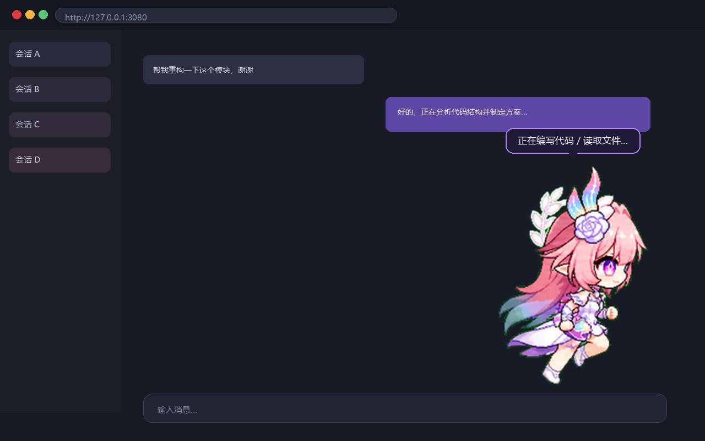
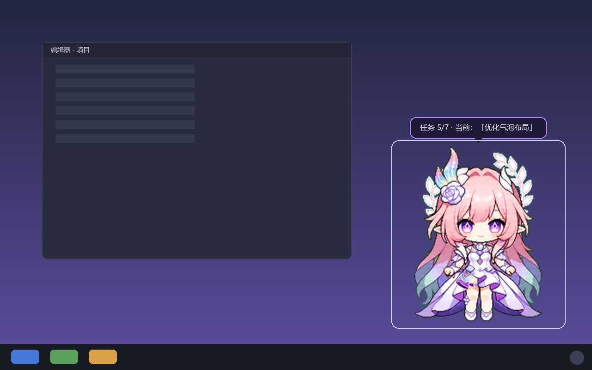
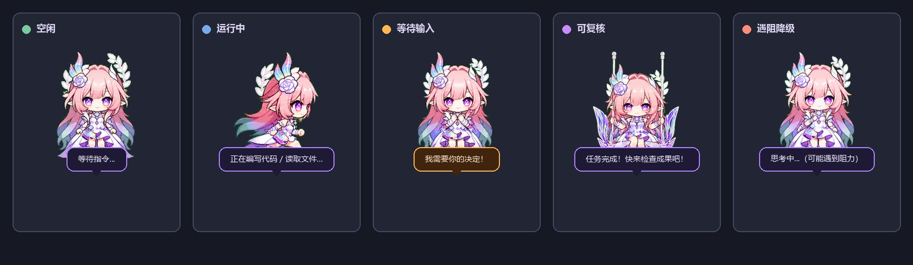

# 桌面宠物进度提醒系统（DeskPet）

一个**跨网页/桌面双端的 AI 任务进度宠物**：通过事件驱动的状态机感知 AI 助手的任务状态（思考/执行/自检/完成/等待输入/遇阻），让一个二次元风格宠物实时切换动画与气泡播报进度——即使你最小化窗口、切到别的应用，她也会置顶常驻、及时提醒你回来处理。

> 本仓库由实际运行的系统整理而来，已参数化所有硬编码路径；开箱可用（内置占位宠物），也支持替换成你自己的精灵图。

[](https://github.com/wind-001/dsh-xilian-pet/actions/workflows/build.yml)

## 预览

| 网页版（浏览器悬浮） | 桌面版（Electron 置顶常驻） |
| --- | --- |
|  |  |

**状态联动**（空闲 / 运行中 / 等待输入 / 可复核 / 遇阻降级）



> 预览图由 `pets/xilian/tools/make_previews.py` 生成（可使用任意精灵图重新生成）。
> 注意：仓库当前预览图含用户自备的角色素材，公开发布前请自行确认版权，或改用内置占位宠物重新生成。

## 功能特性

| 能力 | 说明 |
|------|------|
| 🧠 四状态机 | 空闲💤 / 运行三阶段（🧠思考 → ✍️编码 → 🔧自检）/ 等待输入❗（置顶闪烁）/ 可复核✅ |
| ⚡ 事件驱动 | 订阅 `session/event`、`agent/status`、`approval/request`，非轮询；进度变化 2 秒内反映 |
| 🕒 降级提醒 | 10 秒无进度更新 → 「🤔 可能遇到阻力」 |
| 🖥 双端渲染 | 网页版（浏览器悬浮）+ 桌面版（Electron 置顶透明窗口，**可常驻桌面**） |
| 🔔 系统通知 | 等待输入/任务完成/遇阻时推送原生通知（窗口未聚焦时） |
| 🎬 动画系统 | 9 组动作精灵图，拖拽走跑联动、大小缩放（2x 高清按需加载） |
| 🛡 单实例协调 | 桌面版心跳 + 看门狗自动拉起；永远只有一个宠物在桌面 |
| 🤖 AI 可部署 | 提供完整部署提示词（见 `AI_DEPLOY.md`），任何 AI 助手可照做 |

## 架构（三层）

```
┌─────────────────────────────────────────────────────────┐
│  ① 插件（大脑）                                          │
│  动态 Cordis 插件：事件状态机 / todo 读取 / task.json 导出  │
│  / 宠物看门狗（自动拉起桌面版）/ 网页版渲染                 │
└──────────┬──────────────────────────┬────────────────────┘
           │ task.json / state.json   │ RPC（网页版渲染）
           ▼                          ▼
┌─────────────────────┐   ┌──────────────────────────────┐
│ ③ 共享文件（桥梁）    │   │ ② Electron 桌面应用（显示器）   │
│ pets/xilian/        │   │ 置顶透明窗口 / 动画气泡 / 原生通知│
│  task.json 状态      │   │ 独立运行，2s 读文件，零 harness  │
│  state.json 偏好     │   │ 依赖                          │
│  desktop_alive.json  │   └──────────────────────────────┘
│  心跳                │
└─────────────────────┘
```

## 目录结构

```
xilian-desktop-pet/
├── README.md                 ← 本文件
├── AI_DEPLOY.md              ← ★ 给 AI 助手的部署提示词（推荐阅读）
├── LICENSE                   ← MIT
├── .github/workflows/
│   └── build.yml             ← CI：自动验证资产生成流水线
├── docs/
│   ├── architecture.md       ← 架构详解 + 状态机图
│   ├── troubleshooting.md    ← 已知问题与排查
│   └── customization.md      ← 换精灵图 / 改文案 / 改动画
├── preset/
│   └── persona-section.md    ← Agent 预设公约（可选，让所有会话自动带宠物）
├── assets/
│   ├── spritesheet_placeholder.webp  ← 内置占位宠物（无版权）
│   └── previews/             ← README 预览图（由 make_previews.py 生成）
├── pets/xilian/
│   ├── web/                  ← 构建产物（gitignore；由 tools 生成）
│   ├── plugin/               ← 网页插件源码（host.js / client.js）
│   ├── electron/             ← 桌面应用源码（main/preload/renderer + config.json.example）
│   └── tools/
│       ├── build_sprite.py   ← 精灵图 → 网页资产流水线
│       ├── make_placeholder.py ← 生成占位宠物
│       └── make_previews.py  ← 生成 README 预览图
└── pets/xilian/web_manifest_template.json ← 清单模板
```

## 快速开始（三条路：推荐直接交给 AI）

### ✅ A. 全自动：整仓交给 AI 助手（最省事，推荐）

1. 把本仓库目录作为工作区打开你的 AI 助手（Claude Code / Codex / DSH 等）。
2. 复制粘贴下面这一段（或直接说「按本仓库 `AI_DEPLOY.md` 完整部署桌面宠物」）：

```text
请阅读本仓库的 AI_DEPLOY.md，然后帮我完成「桌面宠物进度提醒系统」的完整部署：
① 检查环境（node ≥18 / python ≥3.8 / Pillow）；
② 用 pets/xilian/tools/make_placeholder.py 和 pets/xilian/tools/build_sprite.py 生成宠物资产；
③ 编辑 pets/xilian/plugin/host.js 顶部 CONFIG：workspaceRoot 填本仓库绝对路径；
④ 用 cordis_define 注册插件（code.host = pets/xilian/plugin/host.js，
   code.client = pets/xilian/plugin/client.js），再 cordis_run 激活并提示我批准；
⑤ 在 pets/xilian/electron 里 npm install electron 并启动桌面版，
   把 desktopAppDir 回填到 CONFIG 后更新插件；
⑥ 按文档验证双端协调（桌面版运行→网页版隐身；刷新→桌面版自动拉起；退出→网页版回归）。
每一步动手前先简短说明你要做什么；遇到问题先自查 AI_DEPLOY.md 和 docs/troubleshooting.md。
```

3. **你只需要做三件事**：批准插件激活、允许 Electron 安装（首次约 100MB）、GitHub 凭据弹窗登录（若走 git 推送）。

> 只想部署网页版？把上面提示词改为「跳过第 ⑤ 步（不部署桌面版），其余照做」即可。

### B. 手动 · 仅网页版（最快，5 分钟）

1. 生成资产（内置占位宠物，或放自己的 `spritesheet.webp` 后执行）：
   ```bash
   python pets/xilian/tools/make_placeholder.py assets/spritesheet_placeholder.webp
   python pets/xilian/tools/build_sprite.py assets/spritesheet_placeholder.webp pets/xilian/web
   ```
2. 编辑 `pets/xilian/plugin/host.js` 顶部 `CONFIG`，填 `workspaceRoot`（本仓库绝对路径）。
3. 让 AI 助手执行（或手动）：用 `cordis_define` 注册插件（`code.host` = `pets/xilian/plugin/host.js` 全文，`code.client` = `pets/xilian/plugin/client.js` 全文），再 `cordis_run` 激活并批准。
4. 宠物出现在网页右下角；任务清单（`todo_write`）变化时她自动播报。

### C. 手动 · 网页 + 桌面双端（完整体验）

1. 完成 B 的 1–2 步。
2. 部署桌面应用：
   ```bash
   cd pets/xilian/electron
   npm install electron --save-dev --cache ./.npm-cache
   npm start                     # 或由插件看门狗自动拉起
   ```
3. 在 `host.js` 的 `CONFIG` 填 `desktopAppDir` / `desktopExe`，启用看门狗自动拉起。
4. 单实例协调自动生效：桌面版在 → 网页版隐身；刷新/关页 → 桌面版自动兜底。

> 详细逐步操作 + 可复制提示词见 **`AI_DEPLOY.md`**——把它整段贴给任何 AI 助手即可完成部署。

## 精灵图说明（重要）

- 仓库**不包含任何受版权保护的精灵图**（原实现使用《崩坏：星穹铁道》同人图，不可再分发）。
- 内置 `assets/spritesheet_placeholder.webp` 为原创占位宠物（MIT），开箱即用。
- 想换自己的宠物：提供一张 **8 列 × 9 行网格、每格 192×208** 的透明背景精灵图（动作行含义见 `docs/customization.md`），放到 `assets/` 后重跑 `build_sprite.py` 即可。若网格不同，用 `--cell` / `--grid` 参数调整。

## 许可证

MIT — 见 [LICENSE](LICENSE)。精灵图请自行确保版权合规。
